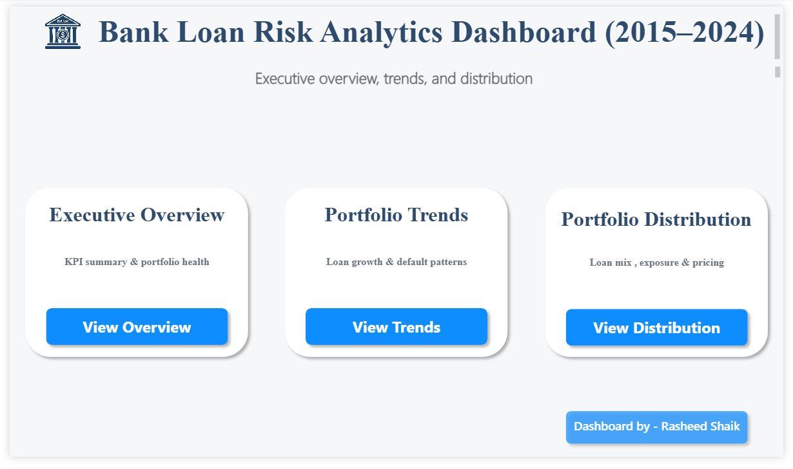
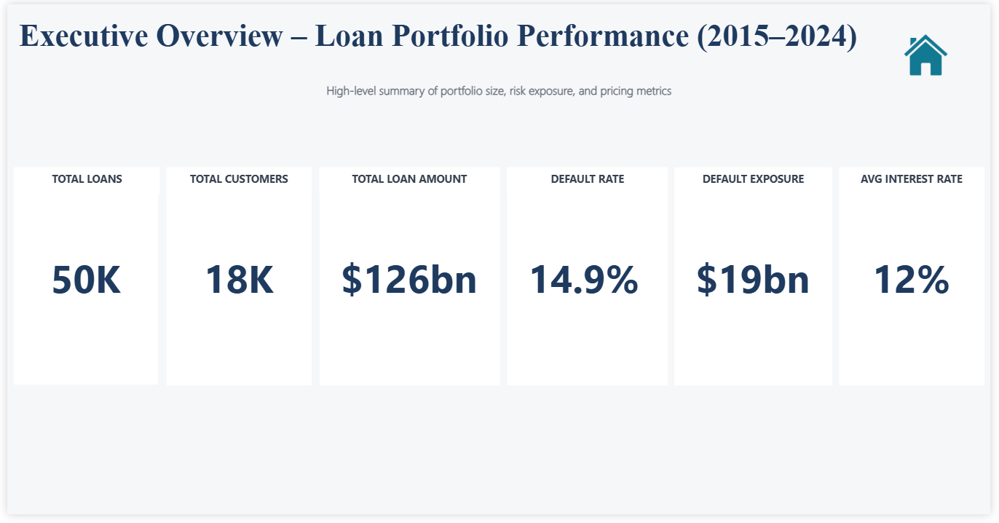
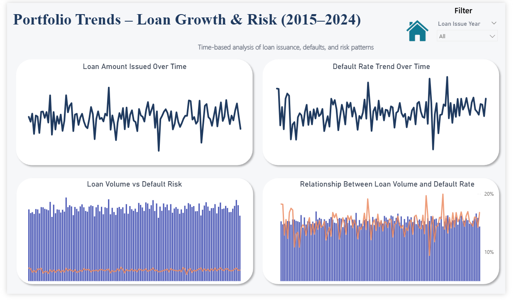
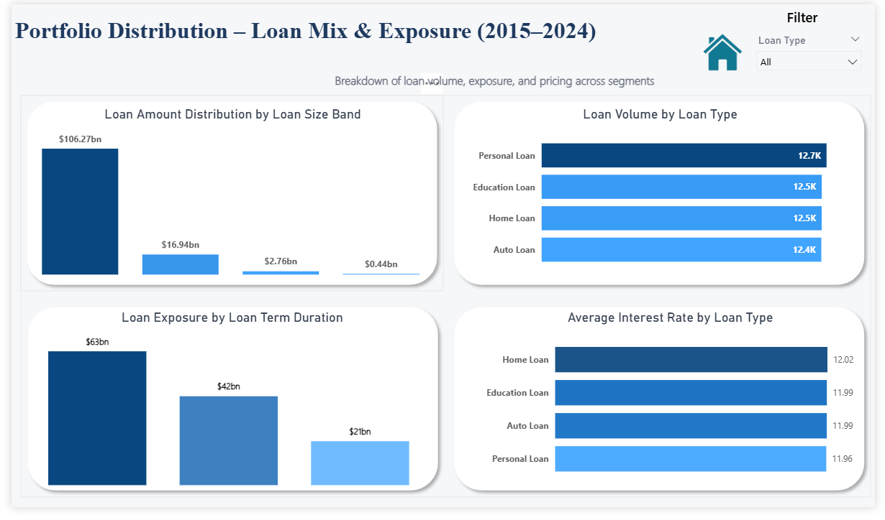

# Bank Loan Risk & Portfolio Analytics (SQL + Power BI)

## Interactive Dashboard (Power BI Desktop)

To explore the interactive Power BI dashboard locally:

1. Download the Power BI Desktop file:  
 👉 [Download](powerbi/bank-loan-risk-analytics-Dashboard.pbix) 
2. Open the file using **Power BI Desktop**.  
3. Update SQL Server connection settings if prompted to refresh data.

> Note: The Power BI file connects to SQL Server. Users may need to configure local database credentials to refresh data.

---

## Project Overview

This project is an end-to-end analytics solution designed to analyze a bank’s loan portfolio and assess portfolio performance, default risk, and exposure distribution over time.

The objective is to support executive and risk-management decision-making by providing:

- High-level portfolio KPIs

- Time-based loan issuance and default trends

- Loan portfolio distribution by type, amount, and tenure

The project follows a real-world analytics workflow, using SQL for data validation, transformation, and business logic, and Power BI for interactive visualization and storytelling.

---

## Business Context

Banks manage large volumes of loans across multiple years. Understanding how loan growth, defaults, and exposure evolve over time is critical for maintaining portfolio health and controlling financial risk.

This solution enables stakeholders to:

- Monitor overall loan portfolio health

- Identify default patterns and risk exposure

- Analyze loan concentration across segments

- Support data-driven lending and risk strategies


## 📂 Repository Structure
```
bank-loan-risk-portfolio-analytics-sql-powerbi/
    │
    ├── data/
    │   └── raw/
    │       ├── Credit_Profile.csv           # Source: Customer credit attributes (SQL Server load)
    │       ├── Customers.csv                # Source: Customer demographic & profile data
    │       ├── Loan_Status.csv              # Source: Loan repayment & default status
    │       └── Loans.csv                    # Source: Loan-level transactional records
    │
    ├── docs/
    │   ├── assumptions.md                   # Project assumptions & data limitations
    │   ├── business_problem.md              # Business context & analytical objectives
    │   └── insights_and_recommendations.md  # Key insights & business recommendations
    │
    ├── powerbi/
    │   ├── 01_user_requirements/            # Stakeholder questions & KPI definitions
    │   ├── 02_chart_selection/              # Visualization rationale
    │   ├── 03_data_modeling/                # Power BI data model design
    │   ├── 04_dashboard_design_pre_layout/  # Wireframes & pre-layout designs
    │   ├── dashboard_screenshots/           # Final dashboard screenshots
    │   └── bank-loan-risk-analytics-Dashboard.pbix  # Power BI report file
    │
    ├── sql/
    │   ├── 01_data_quality_checks.sql       # Data validation & anomaly detection
    │   ├── 02_data_transformation.sql       # Cleansing, standardization, feature engineering
    │   ├── 03_business_logic.sql            # KPI logic & domain rules
    │   └── 04_analytical_views.sql          # Final analytical views for BI tools (Power BI)
    │
    ├── .gitignore
    ├── LICENSE
    └── README.md
```


## SQL Workflow


The SQL layer is structured in logical stages:

1. **Data Quality Checks**

     - Identify NULLs, duplicates, and invalid values

     - Validate ranges and data consistency

2. **Data Transformation**

     - Standardize text fields

     - Create derived columns (age bands, income bands, loan bands)

3. **Business Logic**

     - Join customer, loan, credit, and status data

     - Produce a loan-level master dataset

4. **Analytical Views**

    - Pre-aggregated KPIs

    - Trend and distribution views optimized for Power BI

This layered approach reflects real-world enterprise analytics pipelines. It improves data reliability, reusability, and performance for downstream BI tools.


---

## Power BI Dashboard Design & Planning

Before building dashboards, layout planning and navigation flow were designed using draw.io to ensure:

 - Consistent spacing and alignment

 - Executive-friendly layout

 - Clear navigation between dashboards

The wireframes are available in:

  - **[powerbi/dashbaord_pre_design_layout/](https://github.com/RASHEEDSHAIK7945/bank-loan-risk-portfolio-analytics-sql-powerbi/tree/main/powerbi/04_dashboard_design_pre_layout)**

---
## 📖 Dashboards Overview

The Power BI solution consists of four interconnected dashboards:

 -  **Home Navigation**

     -  Central landing page providing navigation to all dashboards.

 -  **Executive Overview**

     -  High-level KPIs including total loans, total customers, total loan amount,
default rate, defaulted exposure, and average interest rate.

 -  **Portfolio Trends**

    -  Time-based analysis of loan issuance and default behavior to identify
growth patterns and risk trends.

 -  **Portfolio Distribution**

    -  Breakdown of loan portfolio by loan type, loan amount bands,
and loan term categories to analyze exposure concentration.

Dashboard screenshots are available in:

 - **[powerbi/dashboards/](https://github.com/RASHEEDSHAIK7945/bank-loan-risk-portfolio-analytics-sql-powerbi/tree/main/powerbi/dashboard_screenshots)**

---

## 📊 Dashboard Preview

### 🏠 Home Navigation Dashboard
Central landing page providing seamless navigation across all analytical dashboards.



---

### 📈 Executive Overview Dashboard
High-level KPIs summarizing portfolio size, risk exposure, and pricing metrics.



---

### 📉 Portfolio Trends Dashboard
Time-based analysis of loan issuance, default behavior, and risk patterns.



---

### 📊 Portfolio Distribution Dashboard
Breakdown of loan mix, exposure concentration, and interest rate distribution.



---

## Data Sources

The project uses a relational banking dataset loaded directly into SQL Server.

Core entities include:

- Customers

- Loans

- Loan Status

- Credit Profile

All analytical datasets consumed by Power BI are SQL views rather than raw tables.

---

## Insights & Recommendations

Business insights and actionable recommendations derived from the dashboards
are documented separately in:

 - **[docs/insights_and_recommendations.md](https://github.com/RASHEEDSHAIK7945/bank-loan-risk-portfolio-analytics-sql-powerbi/blob/main/docs/insights_and_recommendations.md)**


This ensures the project emphasizes decision-making value, not just visualization.


---

## 🛠️ Tools & Technologies
- **[Datasets](https://github.com/RASHEEDSHAIK7945/bank-loan-risk-portfolio-analytics-sql-powerbi/tree/main/datasets/raw):** Access to the project dataset (raw csv files).
- **[SQL Server Express](https://www.microsoft.com/en-us/sql-server/sql-server-downloads):** Data validation, transformation, dimensional modeling, analytics views
- **[SQL Server Management Studio (SSMS)](https://learn.microsoft.com/en-us/sql/ssms/download-sql-server-management-studio-ssms?view=sql-server-ver16):** Database management and querying
- **[Power BI Desktop](https://www.microsoft.com/en-us/download/details.aspx?id=58494):** Dashboard development and data visualization  
- **[Git & GitHub](https://github.com/):** Version control, documentation, project sharing
- **[DrawIO](https://www.drawio.com/):** Data model and architecture diagram design


---

## Author

**RASHEED SHAIK**  
Data Analyst | SQL | Power BI | Data Warehousing | Data Storytelling  

---

## License

This project is licensed under the MIT License. You are free to use, modify, and share this project with proper attribution.
